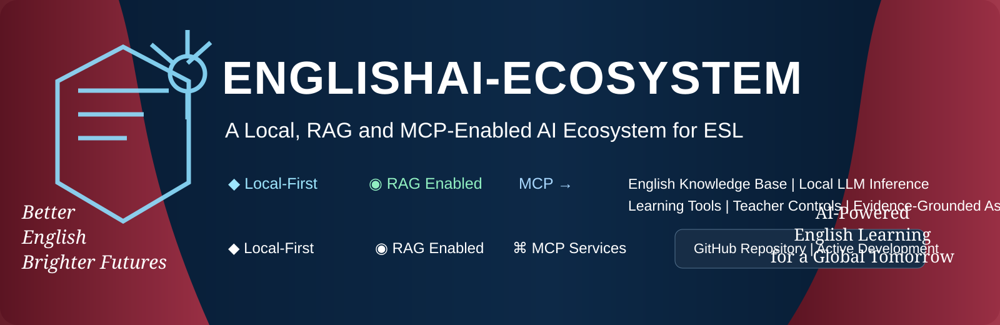

# EnglishAI-Ecosystem

<p align="center">
  
</p>

<p align="center">
  <a href="https://burhanabdullah.github.io/EnglishAI-Ecosystem/">Project Website</a> ·
  <a href="https://github.com/BurhanAbdullah/EnglishAI-Ecosystem">Repository</a> ·
  <a href="./CONTRIBUTING.md">Contributing</a>
</p>

> A local-first, RAG- and MCP-enabled software ecosystem for teaching English as a second or additional language.

EnglishAI-Ecosystem is being developed as a modular learning and research platform rather than as a conventional chatbot wrapper. The system combines English-learning resources, structured learner context, retrieval-augmented generation (RAG), configurable local language-model inference, Model Context Protocol (MCP) services, assessment, provenance, teacher controls, and an adaptive learning loop.

The repository is intentionally separated into two layers of communication:

- **The website (`englishai/`)** is the public-facing product/project presentation: visual architecture, team, participation, contribution pathways, and project overview.
- **This README and the `docs/` tree** are the technical documentation layer: architecture, interfaces, contracts, implementation decisions, security requirements, development procedures, testing, and research direction.

The website should remain concise and accessible. The repository documentation should remain technically explicit and implementation-oriented.

---

## 1. Project leadership

**Burhan Abdullah** — Project Lead · Lead Contributor  
GitHub: https://github.com/BurhanAbdullah

**Dr. Mudasir Rahman** — Project Lead · Lead Contributor  
GitHub: https://github.com/Drmudasirrahman

The project accepts contributions from the wider community. Direct repository contributions and coordinated group participation are intentionally separate workflows; joining the collaboration group is not a prerequisite for submitting ordinary open-source contributions.

---

## 2. System objective

The primary objective is to construct an extensible AI-assisted English-learning environment in which language-model inference is only one component of a larger learning system.

The target learning loop is:

```text
ASK
  ↓
EXPLAIN
  ↓
PRACTISE
  ↓
ATTEMPT
  ↓
FEEDBACK
  ↓
RETRY
  ↓
IMPROVE
```

The architecture is intended to support both learner-facing and teacher-facing workflows. A learner should be able to request an explanation, practise a skill, receive diagnostic feedback, and continue with an appropriately targeted activity. A teacher should be able to work with approved resources, learning activities, rubrics, assessment settings, and learner progress where those controls are enabled.

The system therefore treats an AI response as one event in a pedagogical workflow, not as the final product.

---

## 3. Design principles

### 3.1 Learner-centred execution

Learning activities are represented around learner context, proficiency, target skill, learning goal, previous feedback, and assessment signals. The model is not expected to infer all of this implicitly from a conversation.

### 3.2 Evidence-grounded generation

Where an answer depends on a controlled English-learning resource, retrieval should provide explicit evidence and provenance metadata. The intended flow is:

```text
Source resources
      ↓
Ingestion / preprocessing
      ↓
Metadata
      ↓
Indexing / embeddings
      ↓
Retrieval
      ↓
Evidence set
      ↓
LLM generation
      ↓
Answer + provenance
```

### 3.3 Local-first inference

“Local LLM” describes a deployment and control model; it does **not** mean institution-only AI.

A local model may be operated by an individual, research group, school, university, organisation, laboratory, or another deployment owner. The important architectural property is that the operator can control or configure the model/runtime environment, hardware allocation, access boundaries, model selection, update strategy, knowledge connections, and tool permissions.

The system is therefore designed so that model inference is not conceptually tied to one institution or one infrastructure provider.

### 3.4 Explicit tool boundaries

Specialised operations are separated into MCP services rather than being hidden inside a monolithic prompt or application function. Tools have explicit schemas and should be validated before execution.

### 3.5 Provenance as data

Source information is represented structurally rather than appended as an informal citation string after generation. Provenance can include source identifier, title, locator, version, URI, and retrieval timestamp.

### 3.6 Security and governance by construction

Authentication, authorization, least privilege, tool allow-lists, validation, provenance, audit events, data retention, and credential isolation are architectural requirements for production deployment.

### 3.7 Research reproducibility

The project structure separates application code, schemas, knowledge processing, MCP services, tests, evaluation, documentation, deployment, and research artifacts so that experiments and engineering changes can be reproduced independently.

---

## 4. High-level architecture


The architecture separates four concerns that are frequently collapsed in chatbot systems:

1. **Knowledge** — what information the system is allowed to use.
2. **Inference** — how the language model reasons and generates language.
3. **Capabilities** — what executable operations the system is allowed to invoke.
4. **Learning state** — what the platform knows about learner progress and goals.

---

## 5. Runtime request lifecycle

A representative request can follow the following sequence:

```text
1. Learner submits request
        ↓
2. Application authenticates request
        ↓
3. Learner context is loaded
        ↓
4. Intent / target skill is determined
        ↓
5. Orchestrator decides whether retrieval is required
        ↓
6. RAG retrieves authorised evidence when required
        ↓
7. Orchestrator selects an appropriate MCP capability
        ↓
8. Input schema and permission constraints are validated
        ↓
9. MCP operation executes
        ↓
10. Structured result + provenance returned
        ↓
11. Local LLM generates learner-facing explanation/feedback
        ↓
12. Learning activity is presented
        ↓
13. Attempt / assessment signal is recorded where permitted
        ↓
14. Learner state can be updated
        ↓
15. Next activity can be personalised
```

The exact production transport and persistence implementation remains a development target. The current repository establishes the modular MCP layer and contracts while the complete application/orchestrator integration is being developed.

---

## 6. English-learning capability model

The initial capability decomposition is:

| Capability | Primary responsibility | Example operations |
|---|---|---|
| `english-content` | Approved English-learning resources and source metadata | resource lookup, passage retrieval, source metadata |
| `grammar` | Grammar explanation and error analysis | analyse error, explain rule, generate constrained practice |
| `vocabulary` | Lexical learning | definitions, context, collocations, word families, recall candidates |
| `reading` | Reading comprehension | passage support, questions, evidence extraction, readability signals |
| `writing` | Writing diagnostics and revision support | error diagnosis, clarity feedback, rubric guidance |
| `assessment` | Learning measurement | quizzes, answer validation, skill tagging, mastery signals |
| `citation` | Evidence and provenance | source lookup, provenance construction, citation validation |

Additional capabilities can be introduced without redesigning the complete application as long as they respect the shared protocol and schema boundaries.

---

## 7. Learner context model

The current shared schema defines six proficiency levels and six skill areas:

```text
Proficiency:
A1 · A2 · B1 · B2 · C1 · C2

Skill areas:
grammar · vocabulary · reading · writing · speaking · listening
```

The current `learnerContextSchema` contains:

```text
learnerId
proficiency?
firstLanguage?
targetSkill?
courseId?
learningGoal?
```

This context is deliberately structured because downstream services should not need to infer basic learner state from unstructured prompt text.

A production learner profile is expected to evolve toward a richer state representation containing, where appropriate:

```text
LearnerProfile = {
    identity / account reference,
    proficiency,
    target skills,
    learning goals,
    course context,
    activity history,
    assessment history,
    error patterns,
    vocabulary exposure,
    mastery estimates,
    feedback history,
    preferences,
    consent / retention policy
}
```

The exact production database schema is not yet fixed and should be treated as an implementation/research decision rather than as an already-deployed feature.

---

## 8. MCP architecture

EnglishAI-Ecosystem uses MCP as the capability boundary between the application/orchestrator and specialised English-learning services.

The project models a capability contract as:

```text
T = (N, D, I, O, V, P, S, E)
```

where:

- `N` = capability name
- `D` = description
- `I` = input schema
- `O` = output schema
- `V` = version
- `P` = permission requirements
- `S` = safety constraints
- `E` = evidence/provenance requirements

This abstraction is intended to make tool invocation inspectable and testable.

### MCP primitives

The design distinguishes the three MCP primitives:

**Resources**

Read-oriented learning or governance context, such as passages, grammar material, rubrics, approved resources, source metadata, and policy information.

**Tools**

Executable bounded operations such as grammar analysis, vocabulary lookup, reading analysis, writing diagnosis, assessment generation/validation, and citation validation.

**Prompts**

Reusable pedagogical interaction patterns that can constrain or structure tutoring workflows, such as grammar tutoring, vocabulary coaching, reading tutoring, writing coaching, and evidence-grounded responses.

### Tool execution boundary

```text
LLM / Orchestrator
       │
       ▼
Tool selection
       │
       ▼
Schema validation
       │
       ▼
Permission / policy checks
       │
       ▼
MCP server
       │
       ▼
Bounded operation
       │
       ▼
Structured result
       │
       ├── evidence / provenance
       └── diagnostics / metadata
```

The objective is to prevent implicit arbitrary execution by the model.

---

## 9. Shared data contracts

The current implementation uses Zod schemas in `schemas/mcp-contract.ts`.

### Learner context

```ts
learnerContextSchema = {
  learnerId: string,
  proficiency?: "A1" | "A2" | "B1" | "B2" | "C1" | "C2",
  firstLanguage?: string,
  targetSkill?: "grammar" | "vocabulary" | "reading" |
                 "writing" | "speaking" | "listening",
  courseId?: string,
  learningGoal?: string
}
```

### Provenance

```ts
provenanceSchema = {
  sourceId: string,
  title: string,
  locator?: string,
  version?: string,
  uri?: string,
  retrievedAt: ISODateTime
}
```

### Evidence

```ts
evidenceSchema = {
  quote?: string,
  explanation: string,
  provenance: Provenance[]
}
```

### Common tool envelope

```ts
toolEnvelopeSchema = {
  requestId: string,
  learner: LearnerContext,
  locale: string,
  dryRun: boolean
}
```

The current contract version is:

```text
0.1.0
```

Contract evolution should be versioned deliberately. Breaking changes should not silently invalidate existing MCP clients or test fixtures.

---

## 10. RAG subsystem

RAG is intended to ground model outputs in an authorised English-learning knowledge base.

The conceptual pipeline is:

```text
Raw English resources
        ↓
Document ingestion
        ↓
Cleaning / normalisation
        ↓
Chunking
        ↓
Metadata enrichment
        ↓
Embedding / indexing
        ↓
Candidate retrieval
        ↓
Filtering / reranking
        ↓
Evidence package
        ↓
Local LLM
```

Metadata should be treated as part of retrieval rather than as an optional annotation. Relevant dimensions may include:

- source identifier
- resource title
- resource type
- proficiency level
- skill
- language-learning topic
- author/provider
- version
- publication information
- licensing information
- locator
- retrieval timestamp
- approval status

The current repository contains the architectural separation for `knowledge/`, but the complete production retrieval stack, vector database, embedding model and reranker are not yet declared as fixed implementation choices.

---

## 11. Local LLM deployment model

The local inference layer is intentionally abstracted from the learning tools.

Conceptually:

```text
                   Local inference boundary
                           │
             ┌─────────────┼─────────────┐
             │             │             │
        Model choice     Runtime      Hardware
             │             │             │
             └─────────────┼─────────────┘
                           │
                    Access policy
                           │
                    Knowledge links
                           │
                      MCP access
```

The system does not require one specific local model in its architecture. The deployment owner may select an appropriate model and runtime according to capability, hardware, latency, licensing, privacy, and operational requirements.

This abstraction is important because the EnglishAI architecture should remain independent of a particular model vendor or model family.

---

## 12. Assessment and learning state

Assessment is not intended to be an isolated quiz page. Assessment events can produce structured learning signals:

```text
Activity
   ↓
Attempt
   ↓
Response
   ↓
Diagnostic analysis
   ↓
Skill / error tags
   ↓
Feedback
   ↓
Mastery signal
   ↓
Future practice selection
```

Potential learning-state dimensions include:

- skill proficiency
- recurring grammar errors
- vocabulary exposure and recall
- reading comprehension performance
- writing diagnostics
- assessment history
- recent practice
- confidence or difficulty indicators
- learning goals

The current repository should not be interpreted as already implementing a validated psychometric mastery model. A rigorous mastery estimator is a future research/engineering component and requires explicit evaluation.

---

## 13. Writing assistance philosophy

Writing support is designed around diagnosis and learner revision rather than silent replacement of the learner's writing.

A target workflow is:

```text
Learner text
    ↓
Segmentation / analysis
    ↓
Grammar + lexical + organisation diagnostics
    ↓
Evidence / explanation
    ↓
Revision guidance
    ↓
Learner edits text
    ↓
Re-analysis
```

This keeps the learner involved in the revision loop and provides measurable opportunities to evaluate whether feedback improves subsequent attempts.

---

## 14. Security and governance

Production deployment should enforce the following controls.

### Authentication

Requests should be associated with an authenticated user or controlled service identity before protected resources or learner data are accessed.

### Authorization

Access should be evaluated according to role, resource, tool, operation, and deployment policy. The system should use least privilege rather than granting unrestricted MCP access to the model.

### Tool allow-listing

Only explicitly approved tools should be callable in a given deployment context.

### Resource allow-listing

RAG should retrieve only resources that are authorised for the requesting user, course, deployment, or policy context.

### Schema validation

Tool inputs and outputs should be validated at the protocol boundary. Zod is currently used for the shared TypeScript contract layer.

### Auditability

Sensitive operations should generate structured audit events containing enough metadata to reconstruct what happened without storing unnecessary sensitive learner content.

### Provenance

Source-backed outputs should retain provenance through the processing pipeline.

### Credential isolation

Secrets must remain outside source control and should be provided through environment-specific secret management.

### Learner data lifecycle

Production deployments must define collection, retention, access, correction, export, and deletion policies appropriate to the deployment context.

### Safety boundaries

Tool operations should enforce input-size, output-size, latency, rate, and permission limits. High-impact operations should not be implicitly triggered by generated text.

---

## 15. Repository structure

```text
EnglishAI-Ecosystem/
│
├── README.md
├── LICENSE
├── CITATION.cff
├── CONTRIBUTING.md
│
├── englishai/                  # public multi-page project website
│   ├── index.html
│   ├── architecture.html
│   ├── team.html
│   ├── contribute.html
│   ├── join.html
│   ├── site.css
│   ├── site.js
│   ├── logo.svg
│   ├── banner.svg
│   ├── banner-dark.svg
│   └── architecture.svg
│
├── web/                        # learner-facing web/interface assets
│
├── apps/
│   ├── student-web/
│   └── teacher-dashboard/
│
├── services/
│   ├── orchestrator/
│   ├── rag/
│   ├── llm/
│   └── authentication/
│
├── mcp-servers/
│   ├── english-content/
│   ├── grammar/
│   ├── vocabulary/
│   ├── reading/
│   ├── writing/
│   ├── assessment/
│   └── citation/
│
├── knowledge/
│   ├── ingestion/
│   ├── preprocessing/
│   ├── metadata/
│   ├── indexes/
│   └── datasets/
│
├── learning/
│   ├── grammar/
│   ├── vocabulary/
│   ├── reading/
│   ├── writing/
│   ├── speaking/
│   └── exercises/
│
├── analysis/
│   ├── writing-analysis/
│   ├── vocabulary-analysis/
│   ├── readability/
│   ├── grammar-analysis/
│   └── thematic-analysis/
│
├── schemas/
├── configs/
│
├── tests/
│   ├── unit/
│   ├── integration/
│   ├── mcp/
│   ├── rag/
│   ├── security/
│   └── evaluation/
│
├── scripts/
│   ├── ingest/
│   ├── validate/
│   ├── benchmark/
│   └── deploy/
│
├── deployment/
│   ├── docker/
│   └── production/
│
├── docs/
│   ├── architecture/
│   ├── methodology/
│   ├── pedagogy/
│   ├── rag/
│   ├── mcp/
│   ├── assessment/
│   ├── deployment/
│   └── evaluation/
│
└── research/
    ├── proposal/
    ├── figures/
    ├── experiments/
    └── papers/
```

The `englishai/` website is deliberately separate from the technical documentation hierarchy. Website content should communicate the project to learners, educators, researchers and prospective contributors; the README/docs should document implementation and research details.

---

## 16. Current implementation

The current repository is a prototype foundation, not a claim of a completed production platform.

Implemented foundation includes:

- TypeScript-based project structure.
- Node.js 20+ target.
- MCP TypeScript server architecture.
- Seven initial MCP server domains.
- Shared Zod schemas for learner context, evidence, provenance, and tool envelopes.
- Contract versioning.
- MCP-focused tests.
- Multi-page public project website.
- Interactive architecture presentation.
- Team and contribution pages.
- GitHub-based direct contribution pathway.
- Coordinated team application pathway.
- GitHub Pages deployment workflow.

The current MCP services use development-oriented datasets and should not be represented as a production-scale English knowledge base.

The complete production stack still requires integration and validation of the orchestrator, persistent learner data, production RAG, selected local-model runtimes, authentication/authorization, production MCP transports, observability, evaluation and deployment infrastructure.

---

## 17. Development environment

Current package configuration targets:

```text
Node.js >= 20
TypeScript 5.x
ES modules
MCP TypeScript SDK v2 package
Zod 4
Vitest
tsx
```

Install dependencies:

```bash
git clone https://github.com/BurhanAbdullah/EnglishAI-Ecosystem.git
cd EnglishAI-Ecosystem
npm install
```

Type-check the project:

```bash
npm run typecheck
```

Run the complete test suite:

```bash
npm test
```

Run MCP tests:

```bash
npm run test:mcp
```

Development entry points currently include:

```bash
npm run dev:content
npm run dev:grammar
npm run dev:vocabulary
npm run dev:reading
npm run dev:writing
npm run dev:assessment
npm run dev:citation
```

These commands are development entry points for the current server implementations; they should not be interpreted as the final production deployment topology.

---

## 18. Testing strategy

The intended test hierarchy is:

```text
Unit tests
    ↓
Schema / contract tests
    ↓
MCP server tests
    ↓
Integration tests
    ↓
RAG retrieval tests
    ↓
Security / authorization tests
    ↓
End-to-end learning workflows
    ↓
Educational evaluation
```

### MCP tests

Each MCP server should be tested for:

- tool discovery
- valid input acceptance
- invalid input rejection
- deterministic schema behaviour
- structured output validity
- provenance behaviour where applicable
- permission failures
- edge cases

### RAG tests

Future retrieval evaluation should separately measure:

- recall of relevant evidence
- ranking quality
- metadata filtering correctness
- citation/provenance correctness
- unsupported-answer rate
- retrieval latency

### Learning evaluation

Educational evaluation should not be reduced to LLM response quality. It should examine learning outcomes such as:

- improvement between attempts
- error reduction
- vocabulary retention
- reading comprehension
- writing revision quality
- calibration of assessment signals
- learner usability
- teacher usability

---

## 19. Research and evaluation direction

The architecture supports research questions around:

1. Whether evidence-grounded tutoring reduces unsupported explanations.
2. Whether specialised MCP capabilities improve task reliability relative to monolithic prompting.
3. Whether learner-context conditioning improves the relevance of explanations and practice.
4. Whether iterative feedback improves subsequent learner attempts.
5. How local deployment affects controllability, latency, privacy and operational complexity.
6. How provenance can be propagated through retrieval, tool execution and generated responses.
7. How different retrieval strategies affect English-learning outcomes.
8. How assessment signals can be transformed into defensible mastery estimates.
9. How teacher governance affects the safety and usefulness of AI-assisted learning.

These are research directions, not claims of validated results.

---

## 20. Contribution model

EnglishAI-Ecosystem supports two distinct participation modes.

### A. Direct repository contribution

Anyone can contribute directly through GitHub without joining the coordinated project group.

Typical contributions include:

- bug fixes
- features
- MCP servers
- schema improvements
- tests
- RAG components
- English-learning resources
- pedagogical content
- documentation
- UI/UX improvements
- research utilities
- evaluation datasets
- reproducibility tooling

The normal open-source workflow is:

```text
Fork
  ↓
Create branch
  ↓
Implement change
  ↓
Run tests / checks
  ↓
Commit
  ↓
Push
  ↓
Open Pull Request
  ↓
Review
  ↓
Merge
```

### B. Coordinated collaboration group

Group membership is intentionally different from an ordinary pull request.

Applicants can provide:

- name
- email
- preferred role
- contribution stream
- skills/background
- proposed contribution
- suggestions for EnglishAI

A project lead reviews the application. If approved, the project team can contact the applicant by email with the next collaboration steps.

This workflow is intended for sustained collaboration, shared workstreams and project coordination.

---

## 21. Contribution streams

The current contribution model is intentionally broad.

### Engineering

Application services, TypeScript, APIs, testing, deployment, databases and infrastructure.

### English language and pedagogy

Grammar, vocabulary, reading, writing, assessment design, proficiency modelling and instructional methodology.

### AI / RAG / MCP

Local model integration, retrieval, embeddings, reranking, MCP tools, prompts, schemas and evaluation.

### Research and evaluation

Experimental design, datasets, benchmarks, educational evaluation, reliability studies and reproducibility.

### Documentation and UX

Technical documentation, learner experience, teacher experience, accessibility and information architecture.

### Ideas and partnerships

New learning workflows, datasets, educational use cases, research directions and collaboration opportunities.

---

## 22. Website versus repository documentation

The distinction is deliberate:

| Layer | Purpose | Audience |
|---|---|---|
| `englishai/` | Public project website | Learners, educators, researchers, contributors, visitors |
| `README.md` | Technical system overview | Developers, researchers, reviewers |
| `docs/` | Detailed engineering/design documentation | Developers and researchers |
| `mcp-servers/` | Executable MCP capability implementations | Developers |
| `schemas/` | Shared machine-readable contracts | Developers / services |
| `tests/` | Verification | Developers / CI |
| `research/` | Research artifacts | Researchers |

The website is therefore not intended to replace this README, and the README is not intended to duplicate the website's marketing/presentation content.

---

## 23. Roadmap

### Phase 1 — Foundation

- MCP server separation
- Shared contracts
- Initial learning capabilities
- Website and project documentation
- Baseline tests

### Phase 2 — Core AI integration

- Orchestrator service
- Local LLM adapter interface
- RAG ingestion and retrieval pipeline
- Persistent learner profile
- Production-ready MCP transport

### Phase 3 — Learning intelligence

- Adaptive practice selection
- Assessment and mastery models
- Improved writing diagnostics
- Vocabulary retention workflows
- Reading progression
- Teacher dashboard integration

### Phase 4 — Evaluation

- Retrieval benchmarks
- Tool reliability benchmarks
- Educational outcome studies
- Safety/security evaluation
- Human evaluation
- Reproducibility packages

### Phase 5 — Deployment

- Containerised services
- Authentication and authorization
- Observability
- Secrets management
- Data lifecycle controls
- Deployment profiles for different operators

The roadmap is subject to engineering and research validation; future components should not be represented as currently implemented until they exist in the repository and pass their relevant checks.

---

## 24. Technical documentation

Detailed documentation is organised under:

```text
docs/
├── architecture/
├── methodology/
├── pedagogy/
├── rag/
├── mcp/
├── assessment/
├── deployment/
└── evaluation/
```

The current MCP architecture specification is available at:

```text
docs/mcp/MCP-ARCHITECTURE.md
```

The shared contract implementation is:

```text
schemas/mcp-contract.ts
```

---

## 25. Status and scope statement

**Current status: prototype / active development.**

EnglishAI-Ecosystem currently establishes the architectural and MCP foundation and a public multi-page project website. It is not yet a fully deployed production learning platform.

In particular, production claims should wait for implementation and evaluation of:

- end-to-end orchestrator integration
- production RAG
- persistent learner profiles
- selected local LLM runtime(s)
- authentication and authorization
- production MCP transport/deployment
- security controls
- provenance propagation
- educational evaluation
- operational monitoring

This distinction is important for reproducibility and for preventing the documentation from claiming capabilities that are only planned.

---

## 26. License

This project is released under the MIT License. See [`LICENSE`](./LICENSE).

---

## 27. Project links

**Website:** https://burhanabdullah.github.io/EnglishAI-Ecosystem/  
**Repository:** https://github.com/BurhanAbdullah/EnglishAI-Ecosystem  
**Burhan Abdullah:** https://github.com/BurhanAbdullah  
**Dr. Mudasir Rahman:** https://github.com/Drmudasirrahman
